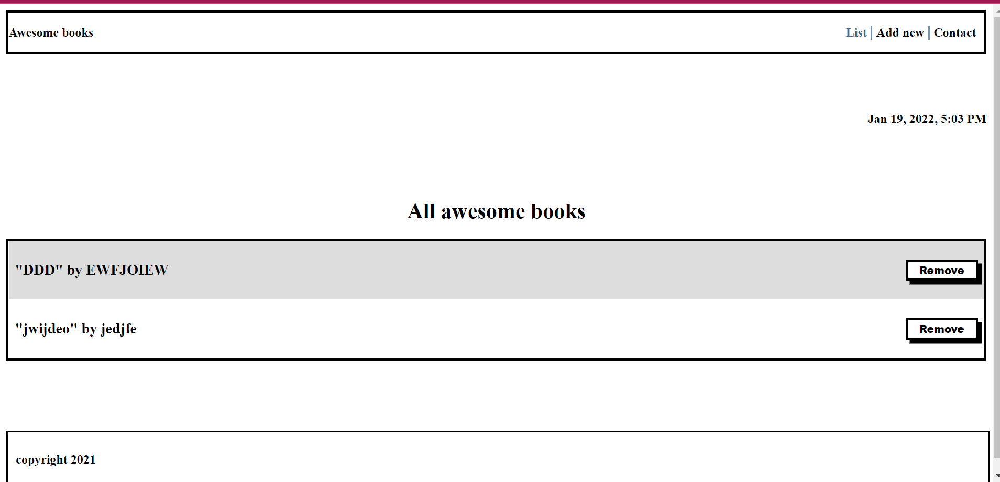

# AwesomeBooks

This is a wesbite where you can add and remove books.

This project is my portfolio.

## Built With

- Javascript
- HTML
- CSS

[Live Demo](https://zairdon20.github.io/AwesomeBooks-ES6/)

## Getting Started

To get the content of this project locally you need to run this command in your terminal:

- git clone your https://github.com/zairdon20/AwesomeBooks-ES6.git
- cd project My-Portfolio
- open the index.html file to see project running.

### Deployment

This project is deployed on a github page on the link below:

- https://zairdon20.github.io/AwesomeBooks-ES6/

👤 **Josphat Nkonde**

- GitHub: [@zairdon20](https://github.com/zairdon20)
- Twitter: [@Josphat1](https://twitter.com/Josphat1/)
- LinkedIn: [zairdon](https://www.linkedin.com/in/zairdon/)

## 📝 License

This project is [MIT](./MIT.md) licensed.
